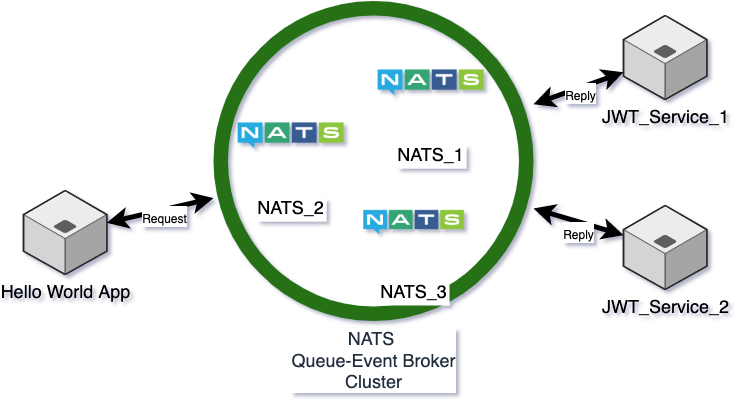

# Go-Nats-Endpointless-Microservices-Communication  
This is the repository of building example app architecture for testing NATS.io Request&Reply methodology with single `docker-compose up -d` command.  

# Architecture  

